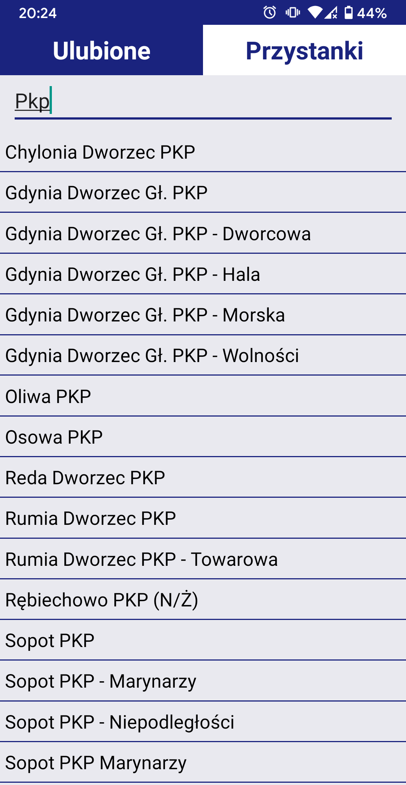
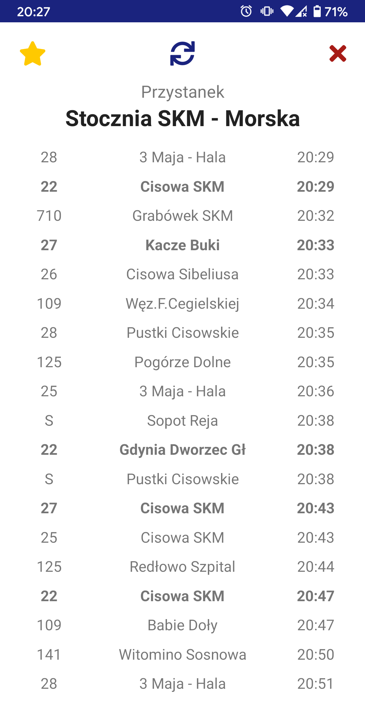

# MZKZG

### Polish app displaying a real time timetable from Tristar stop system in Tri-City.
The data comes from [Tristar API](http://91.244.248.19/dataset/tristar).

Keep in  mind that the data is not 100% accurate. 

It's just an approximation but usually works out much better then fixed timetable.
Although it display the data only up to something like 30 minutes it the future.

## Download
### Android:
1. Make sure you have `unknown sources` option checked
2. Download .apk from [Releases](https://github.com/aklein13/mzkzg/releases)
3. Install it

### iOS
###### Coming soon!

## Screenshots:

### List of stops

You can search in general stop list including every stop from every city.

### Stop timetable

List of departures for specified stop alongside with headsign and destination.
- Press star to add a stop to favourites
- Press refresh icon or use refresh gesture to refresh the list
- Press red cross to exit
- Long press to add a bus line to favourites which will be indicated with a bold font on every stop.


## Dev Instruction:
1. After downloading repository run [Yarn](https://yarnpkg.com/)
```bash
$ yarn
```
2. Use either `react-native run-android` or `react-native run-ios`

## TODO:
- fix refresh spam on entering stop timetable without active internet connection
- iOS app release
- sort stops by distance from the user (GPS)
- display stops on the map
- display bus routes on the map?
